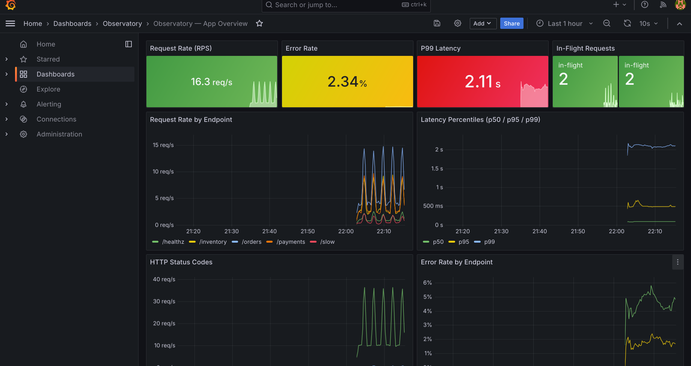
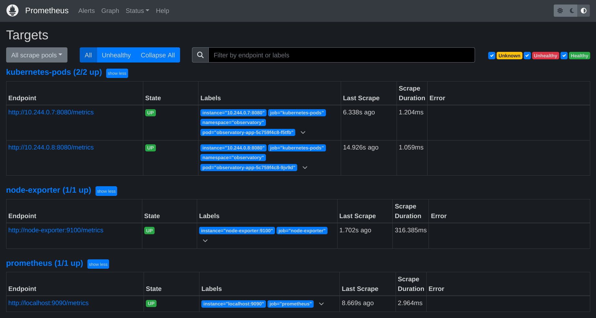
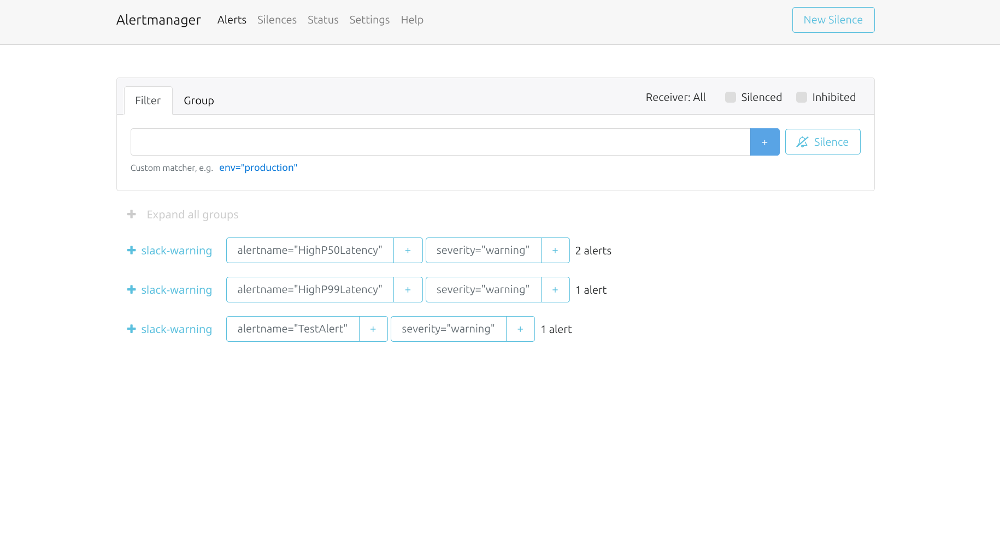
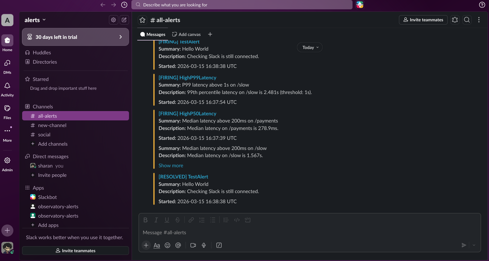

# go-sre-observatory

A production-grade observability platform running on Kubernetes - built to demonstrate SRE engineering practices through a fully instrumented Go microservice. Covers the three pillars of observability: metrics, logs, and alerting. A built-in load generator keeps dashboards live at all times.

> Built as part of a DevOps/SRE portfolio transition from 4 years of cloud operations (Oracle Cloud, Ctrls Datacentres). This project bridges hands-on infrastructure experience with platform engineering.

---

```
Code change → git push
    ↓
GitHub Actions: test → build → push to GHCR
    ↓
./deploy.sh locally:
    - injects SLACK_WEBHOOK_URL from env
    - applies all manifests
    - pulls latest image (Always policy)
    - port-forwards everything
    ↓
Full stack running:
    - Go app serving traffic
    - Prometheus scraping metrics
    - Grafana showing dashboard + logs
    - Loki receiving logs via Promtail
    - Alertmanager routing to Slack
```

## Screenshots

### Grafana — live dashboard with traffic spikes

16 req/s baseline with periodic 40 RPS spikes every 2 minutes. P99 latency shown in red — driven by the intentionally slow `/slow` endpoint breaching the 1s SLO threshold.

### Prometheus — auto-discovered scrape targets

Prometheus auto-discovers pods via `prometheus.io/scrape` annotations — no static config needed. Both app replicas, node exporter, and Prometheus itself all healthy.

### Alertmanager — alerts firing and routed to Slack

Three active alert groups: `HighP50Latency` on `/payments` and `/slow`, `HighP99Latency` on `/slow`, all routing via `slack-warning` receiver.

### Slack — real alert messages in #all-alerts

End-to-end alert delivery: Prometheus evaluates rules → Alertmanager routes → Slack receives structured messages with summary, description, and timestamp. `[RESOLVED]` messages fire automatically when conditions clear.

---

## What this demonstrates

| Practice | Implementation |
|---|---|
| Metrics instrumentation | Go app exposes RED metrics (Rate, Errors, Duration) via `prometheus/client_golang` |
| Kubernetes-native discovery | Prometheus scrapes pods via `prometheus.io/scrape` annotations — zero static config |
| Log aggregation | Structured JSON logs shipped via Promtail → Loki, queryable alongside metrics in Grafana |
| Alerting pipeline | Prometheus rules → Alertmanager → Slack with severity routing and runbook links |
| Realistic traffic simulation | Load generator produces 10 RPS baseline + 40 RPS spikes every 2 minutes |
| Runbook-driven operations | Every alert rule includes a runbook with diagnosis steps |
| Infrastructure as code | Entire stack deployable with a single command, torn down with another |

---

## Architecture

```
┌──────────────────────────────────────────────────────────┐
│                   Kubernetes — namespace: observatory      │
│                                                            │
│  ┌──────────────┐  GET /metrics   ┌───────────────────┐  │
│  │  Go app      │ ──────────────► │   Prometheus      │  │
│  │  :8080       │   every 15s     │   TSDB storage    │  │
│  │              │                 └─────────┬─────────┘  │
│  │  /orders     │  stdout logs              │             │
│  │  /payments   │ ──────────────► Promtail  │ alert rules │
│  │  /inventory  │                 → Loki    │             │
│  │  /users      │                           ▼             │
│  │  /slow       │                 ┌───────────────────┐  │
│  └──────────────┘                 │   Alertmanager    │  │
│                                   │   Slack routing   │  │
│  ┌──────────────┐                 └─────────┬─────────┘  │
│  │  Load gen    │                           │             │
│  │  10 RPS      │                           ▼             │
│  │  + spikes    │                 ┌───────────────────┐  │
│  └──────────────┘                 │   Grafana :3000   │  │
│                                   │   + Loki datasource│  │
│  ┌──────────────┐                 └───────────────────┘  │
│  │ Node exporter│                                         │
│  │ host metrics │           Slack #all-alerts             │
│  └──────────────┘                ▲                        │
│                                  │ webhook                │
└──────────────────────────────────┼────────────────────────┘
                                   │
                            Alertmanager
```

---

## Stack

| Component | Version | Role |
|---|---|---|
| Go | 1.22 | Instrumented HTTP server |
| Prometheus | 2.51 | Metrics scraping, storage, alert evaluation |
| Grafana | 10.4 | Dashboards — auto-provisioned on deploy |
| Alertmanager | 0.27 | Alert deduplication, grouping, Slack routing |
| Loki | 3.0 | Log aggregation and storage |
| Promtail | 3.0 | Log shipping DaemonSet |
| Node Exporter | 1.8 | Host CPU, memory, disk metrics |
| Kubernetes | 1.28+ | Orchestration via minikube |

---

## Getting started

### Prerequisites

- [minikube](https://minikube.sigs.k8s.io/docs/start/) ≥ 1.32
- [kubectl](https://kubernetes.io/docs/tasks/tools/) ≥ 1.28
- [Docker](https://docs.docker.com/get-docker/)
- 4 CPU cores and 4 GB RAM

### Deploy

```bash
git clone https://github.com/yourusername/go-sre-observatory
cd go-sre-observatory

# optional — set your Slack webhook so alerts route automatically
export SLACK_WEBHOOK_URL="https://hooks.slack.com/services/YOUR/WEBHOOK"

./deploy.sh
```

The script handles everything: starts minikube, builds both Docker images inside the cluster daemon, applies all manifests in dependency order, waits for rollouts, and opens port-forwards.

### Access the UIs

| Service | URL | Credentials |
|---|---|---|
| Grafana | http://localhost:3000 | admin / observatory |
| Prometheus | http://localhost:9090 | — |
| Alertmanager | http://localhost:9093 | — |
| App | http://localhost:8080 | — |

The Grafana dashboard auto-provisions under **Dashboards → Observatory → App Overview**.

### Tear down

```bash
./teardown.sh
```

---

## Application endpoints

| Endpoint | Latency | Error rate | Purpose |
|---|---|---|---|
| `GET /healthz` | ~0ms | 0% | Health check and liveness probe |
| `GET /orders` | 20–200ms | ~5% (503) | Simulates upstream timeout failures |
| `GET /payments` | 50–500ms | ~2% (502) | Simulates payment gateway errors |
| `GET /inventory` | 5–40ms | 0% | Fast read endpoint |
| `GET /users` | 10–70ms | ~1% (404) | User lookup with rare failures |
| `GET /slow` | 800–2000ms | 0% | Intentional SLO breach for latency alerts |
| `GET /metrics` | — | — | Prometheus metrics exposition |

The `/slow` endpoint exists specifically to trigger `HighP99Latency` and `HighP50Latency` alerts — making the alerting pipeline demonstrable without having to inject real failures.

---

## Metrics exposed

```
# Total requests — labelled by method, path, status code
http_requests_total{method="GET", path="/orders", status="200"} 1423

# Latency histogram — used to compute p50/p95/p99 in Grafana
http_request_duration_seconds_bucket{method="GET", path="/payments", le="0.25"} 891

# Current in-flight requests (gauge — goes up and down)
http_requests_in_flight 3

# Application errors — labelled by path and error type
app_errors_total{path="/orders", error_type="upstream_timeout"} 12

# Build info — lets you correlate incidents with deployments
app_info{version="1.0.0", goversion="go1.22"} 1
```

Every metric is recorded automatically by the `instrument()` middleware — handlers contain only business logic.

---

## Alert runbooks

### `HighErrorRate`
**Fires when:** 5xx error rate exceeds 5% over a 5-minute window.

```bash
# Which endpoints are throwing errors?
kubectl logs -l app=observatory-app -n observatory --tail=50 \
  | grep '"level":"error"'

# Per-path breakdown in Prometheus:
# sum(rate(http_requests_total{status=~"5.."}[5m])) by (path)
```

Likely causes: upstream dependency down, bad deployment rollout, pod OOMKill.
```bash
kubectl describe pods -l app=observatory-app -n observatory
```

---

### `HighP99Latency`
**Fires when:** P99 latency on any endpoint exceeds 1s for 5 minutes.

```bash
# Which path is slow?
# histogram_quantile(0.99, sum(rate(http_request_duration_seconds_bucket[5m])) by (le, path))

# Is the system saturated?
# http_requests_in_flight
```

Note: `/slow` will always breach this threshold by design. In production, exclude it from SLO calculations using a `path!="/slow"` filter.

---

### `HighP50Latency`
**Fires when:** Median latency on any endpoint exceeds 200ms for 5 minutes.

```bash
# histogram_quantile(0.50, sum(rate(http_request_duration_seconds_bucket[5m])) by (le, path))
```

A rising p50 often indicates a systemic issue rather than tail latency — check for resource contention on the node.

---

### `AppDown`
**Fires when:** A pod has been unreachable for 1 minute.

```bash
kubectl get pods -n observatory
kubectl describe pod <pod-name> -n observatory
kubectl logs <pod-name> -n observatory --previous
```

---

## Project structure

```
go-sre-observatory/
├── app/
│   ├── main.go            # Go HTTP server with Prometheus instrumentation
│   ├── go.mod
│   └── Dockerfile         # Multi-stage build — golang:alpine → alpine
├── k8s/
│   ├── app/
│   │   └── deployment.yaml
│   ├── monitoring/
│   │   ├── prometheus.yaml    # Deployment + RBAC + alert rules
│   │   ├── grafana.yaml       # Deployment + auto-provisioned dashboard
│   │   ├── alertmanager.yaml  # Deployment + Slack routing config
│   │   └── node-exporter.yaml
│   ├── logging/
│   │   └── loki-promtail.yaml
│   └── loadgen/
│       ├── main.go        # Weighted traffic generator with spike logic
│       ├── Dockerfile
│       └── deployment.yaml
├── docs/
│   └── screenshots/
├── deploy.sh              # One-command deploy to minikube
├── teardown.sh
└── README.md
```

---

## Design decisions

**Why Go for the app?** Go's Prometheus client is first-class, compile times are fast, and the resulting binary is small. The app compiles to under 10MB in the final image.

**Why raw manifests instead of the Prometheus Operator?** The Operator is the right tool for multi-team production setups. Using raw manifests here makes the RBAC, scrape configuration, and alert rules fully explicit — every line is visible and explainable.

**Why Loki over ELK?** Loki uses the same label model as Prometheus. The same labels that identify a pod in a Prometheus query (`namespace`, `pod`, `app`) find its logs in Loki — no separate index infrastructure or schema to maintain. Resource footprint is also significantly lighter.

**Why a custom load generator over k6 or Locust?** Running a Go generator inside the cluster avoids external network overhead and keeps the entire demo self-contained. It also adds a second Go service to the repo, demonstrating the language beyond a single file. For production load testing, k6 would be the right tool.

**Why two app replicas?** The Prometheus targets screenshot shows both replicas scraping independently — demonstrating Kubernetes-native service discovery working as designed, not just a single-pod proof of concept.